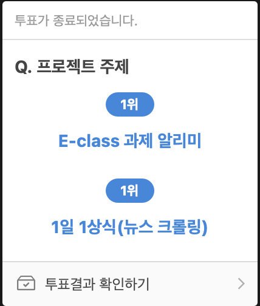

# 2023-1-MCTeamProject
##### 1. 파일별 변경 사항은 각 폴더의 READMD.md에 작성
##### 2. 오류는 마크다운 언어로 .md 파일 생성 후 작성
##### 3. 주기적인 회의의 회의록은 README.md 파일에 작성 
##### 4. 커밋은 < 작업 이름 : 커밋 날짜 > 와 같이 작성한다.

- 참고 사이트 : [마크다운 사용법] <https://gist.github.com/ihoneymon/652be052a0727ad59601>
- 참고 : 어플리케이션 필수 구현 목록
    - activity, fragment  각각 2개 이상 사용 
    - DB사용 및 insert, delete 기능이 앱에서 작동
    - DB를 위한 Table 설계 & Data를 동적으로 view를 통해 보여주는 기능
    -  안정적 작동 필요
    -  추가 : 필수 구현 외의 앱 기능, 구현 난이도, 외부 API 라이브러리 연동 (추가 점수)
#### 조원 : 김광영, 길현서, 오명빈

### 2023.05.12(금) 11AM
##### 주제 공유 - 회의록 작성 : 김광영

* 김광영
    1. e-class 알리미   
[e-class 과제 알리미] 
<https://github.com/Nine1ll/AssignmentNotification>   
기존에 본인이 만들었던 기능을 기반(파이썬, 셀레니옴)으로 api화 시켜 연동 제안

* 길현서
    1. 날짜별 식단 기록 앱
    2. 데일리 룩북 기록 앱
    3. 알림 키워드 클러스터링 앱
    4. 1일 1상식(뉴스 크롤링)

* 오명빈
    1. 전국 공공화장실 위치 알리미
    2. 전국 지진 대피소 알리미

### 2023.05.14(일) 9PM
##### 주제 확정 및 기능 & Project 이름 정하기 - 회의록 작성 : 김광영

1. 카카오톡 투표 기능을 통해 투표 진행   
    </img> 

2. 이후 구현 난이도 및 중요도 평가 후 주제 선정 (1일 1상식)
    - 회의를 통해 길현서 팀원이 제시한 : **1일 1상식**(뉴스 크롤링)이 선정됨   
    
3. 주제 선정 이후 간단한 어플리케이션 기능 선정(추후 변경 및 추가 가능)
    1. 뉴스를 키워드 별로 묶음(제공 사에 관계없이, 여기서 제공사는 네이버, 다음과 같은 사이트를 이야기한다)
    2. 키워드 선택시 이전날짜의 뉴스들도 노출 해줌
    3. 해당 이슈에 대한 반응의 시각화 제공
    4. 추후 논의를 통해 추가 예정    

4. 기능에 맞는 어플리케이션 이름 선정 (Mind-Fuel)
    - 제안 나온 NewsHub, KeywordInsight, NewsPulse, Mind Fuel, Brain Bites 중에 
    - 오명빈 조원이 제안한 : **Mind-Fuel**이 프로젝트명으로 선정됨
    - 선정 이유 : 독특하고 감각적이며 지식과 정보를 제공하는 어플리케이션을 떠오르게함, 뉴스와 관련된 키워드를 통해 사용자의 지적 욕구를 충족시켜주고, 마치 마음에 영양을 공급하는 듯한 느낌을 주는 이름   
